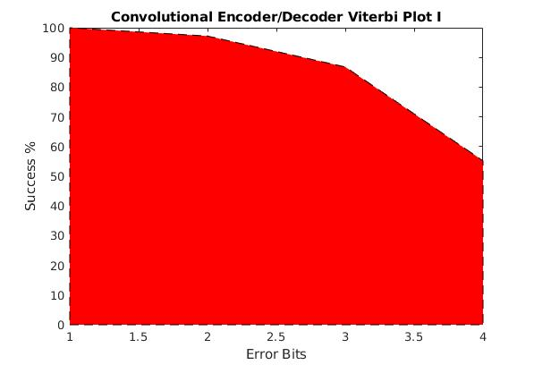

Govind Jeevan (16CO221)
Darshan D V (16CO216)

MATLAB code for  convolution code (2, 1, 10) decoding with g1 = 110111 and g2  =  11101101  and  the  analysis  of  %  of  error  detection  and  correction  using Viterbi decoding and path metric.

Open the assg1_216_221.m file in matlab.

Run the code ( Cntl + Enter ).

The command window will display the

- Encoded Code Word
- The Error word
- The corrected codeword

if corrected succesfully, it will display "Correction Succesful"

